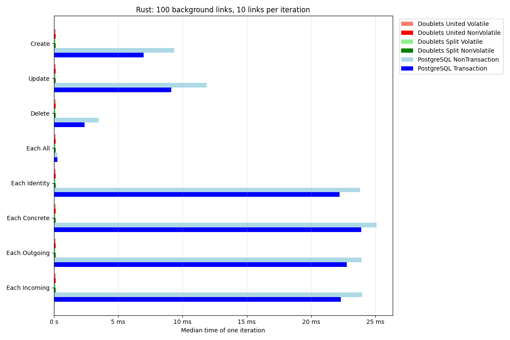
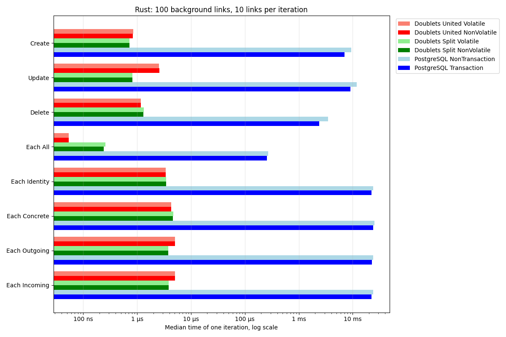
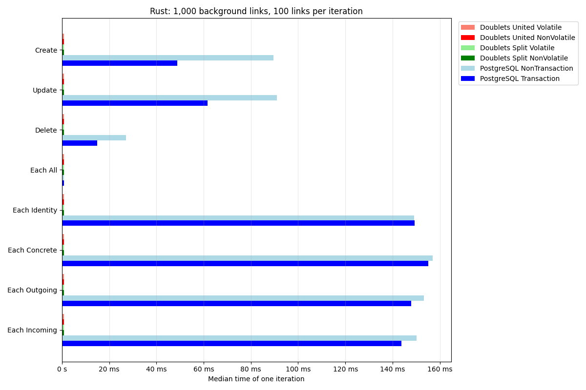
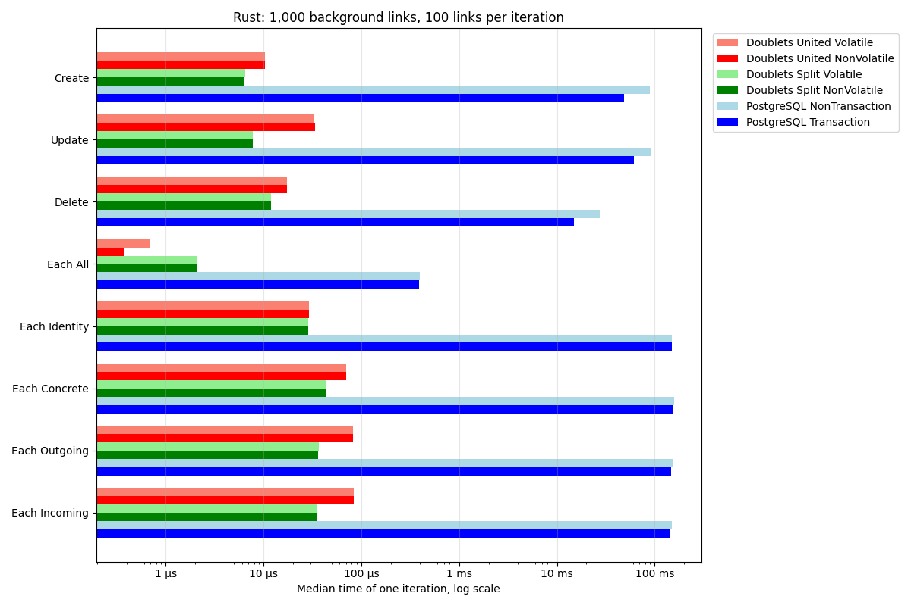
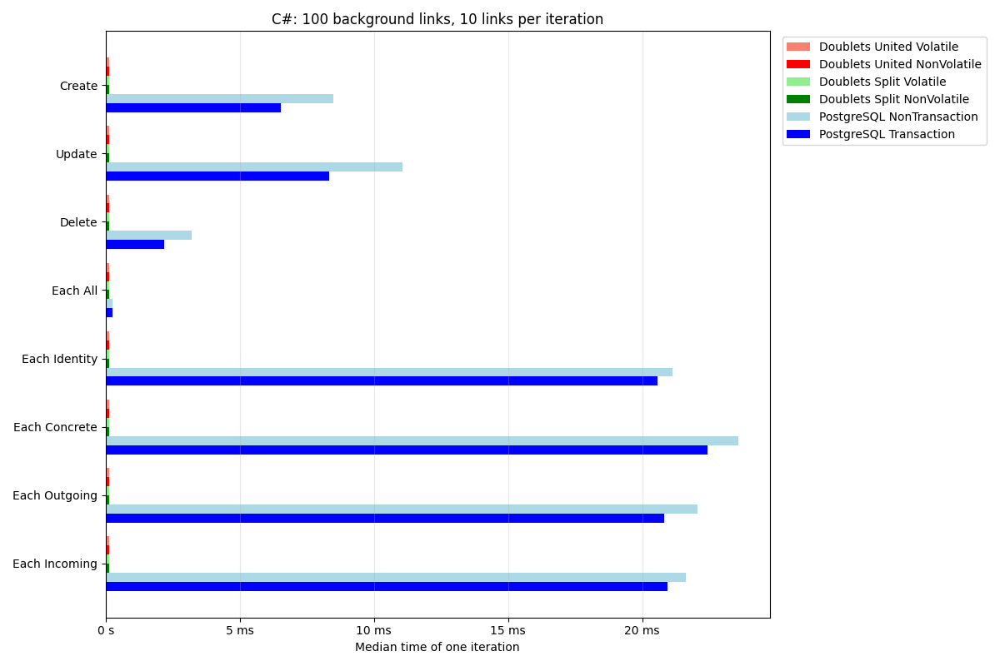
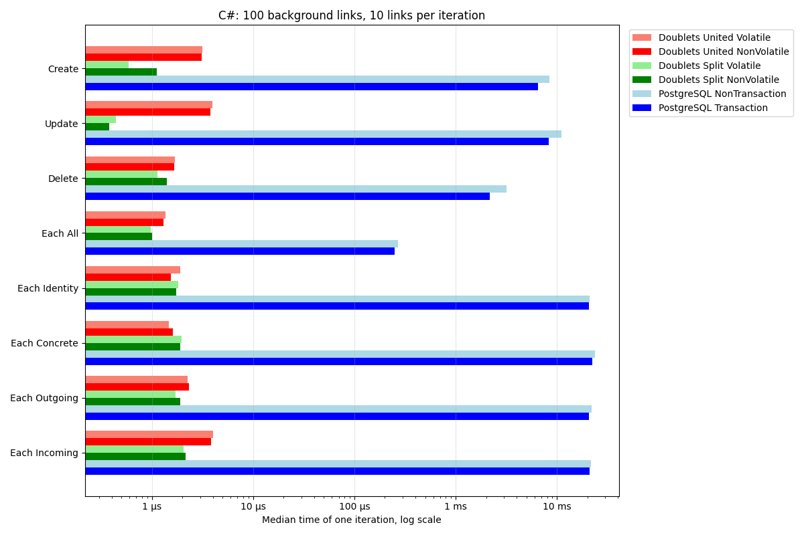
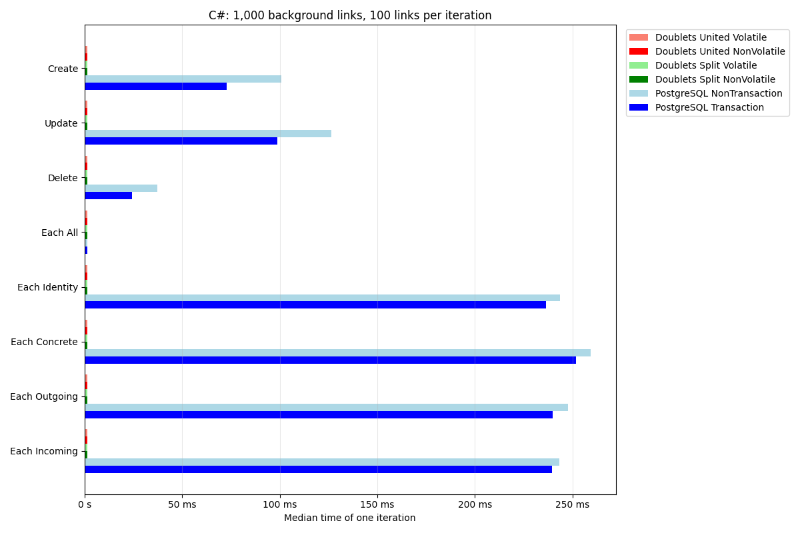
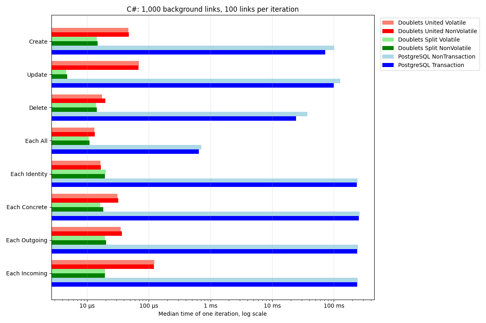

# Comparisons.PostgreSQLVSDoublets

PostgreSQL and LinksPlatform Doublets compared on the same basic link operations in Rust and C#. A doublet link has an ID, a source and a target. See [the links theory](https://habr.com/ru/articles/895896) for the representation.

Each language runs four Doublets stores (united/split, in RAM/memory-mapped files) and two PostgreSQL modes (autocommit/explicit transaction). PostgreSQL uses a `bigint` identity primary key and separate B-tree indexes on source and target. Doublets runs inside the benchmark process; PostgreSQL uses a local server and includes driver and network costs. Memory-mapped Doublets writes use the OS page cache without an explicit disk flush; their durability differs from PostgreSQL commits.

## Operations

- **Create**: create `BENCHMARK_LINKS` point links (`id = source = target`).
- **Update**: change the last `BENCHMARK_LINKS` background points to `(0, 0)` and back, timing both updates.
- **Delete**: prepare `BENCHMARK_LINKS` additional points, then delete those points in reverse order.
- **Each All**: enumerate all background links once (`[*, *, *]`).
- **Each Identity**: enumerate `[id, *, *]` for each background point.
- **Each Concrete**: enumerate `[*, source, target]` for each background point.
- **Each Outgoing**: enumerate `[*, source, *]` for each background point.
- **Each Incoming**: enumerate `[*, *, target]` for each background point.

Both languages recreate `BENCHMARK_BACKGROUND_LINKS` points before each iteration and clear the store afterwards. Background creation, delete preparation, table/index setup and cleanup are excluded from the measured time. In transaction mode the timed SQL operations run inside an explicit transaction; its begin and commit happen outside the timed interval. Thus these numbers measure operation batches, rather than committed transactions or individual links. Indexed reads perform one query per background point, independently of `BENCHMARK_LINKS`.

Both harnesses use one second of warm-up, ten flat samples and a one-second measurement target. Iteration counts are calibrated using total wall time including preparation, as Criterion 0.4 does for `iter_custom`; reported samples include only timed operations. The report shows medians and compares each Doublets median with the fastest PostgreSQL median. Medians within 5%, or overlapping ± one standard deviation ranges, are labelled `≈ same`. Other cells show `× faster` or `× slower`. Linear charts give very short bars a minimum visible width; log charts use the measured values.

## Results

Every generated table records the server and library versions, CPU, UTC date and source Actions run. CI runs on separate runners for each language, backend and size. PRs use 100 background / 10 active links. Default-branch runs also measure 1,000 background / 100 active links. A report job assembles all tables and linear/log charts, uploads them for PR review, and commits results after default-branch pushes. Changes only to this README or the charts do not start benchmarks.

<!-- results:start -->
<!-- markdownlint-disable MD013 MD024 -->

### Rust

#### Rust: 100 background links, 10 links per iteration

_Median time of one iteration with 10 links. PostgreSQL 17.6 (Debian 17.6-2.pgdg13+1) through postgres 0.19.7; doublets 0.3.0. CPU AMD EPYC 9V74 80-Core Processor, [GitHub Actions run](https://github.com/linksplatform/Comparisons.PostgreSQLVSDoublets/actions/runs/37549306074) on 2026-10-06T23:58:58+00:00._

| Operation | Doublets United Volatile | Doublets United NonVolatile | Doublets Split Volatile | Doublets Split NonVolatile | PostgreSQL NonTransaction | PostgreSQL Transaction |
| --- | ---: | ---: | ---: | ---: | ---: | ---: |
| Create | 846 ns (8,260× faster) | 838 ns (8,340× faster) | 721 ns (9,690× faster) | 722 ns (9,680× faster) | 9.36 ms | **6.99 ms** |
| Update | 2.54 µs (3,600× faster) | 2.58 µs (3,550× faster) | 819 ns (11,200× faster) | 824 ns (11,100× faster) | 11.9 ms | **9.14 ms** |
| Delete | 1.18 µs (2,010× faster) | 1.17 µs (2,040× faster) | 1.33 µs (1,780× faster) | 1.3 µs (1,830× faster) | 3.49 ms | **2.37 ms** |
| Each All | 54 ns (4,700× faster) | 54 ns (4,700× faster) | 258 ns (984× faster) | 240 ns (1,060× faster) | 272 µs | **254 µs** |
| Each Identity | 3.41 µs (6,520× faster) | 3.38 µs (6,570× faster) | 3.46 µs (6,430× faster) | 3.46 µs (6,430× faster) | 23.8 ms | **22.2 ms** |
| Each Concrete | 4.3 µs (5,570× faster) | 4.27 µs (5,600× faster) | 4.66 µs (5,140× faster) | 4.65 µs (5,150× faster) | 25.1 ms | **23.9 ms** |
| Each Outgoing | 5.08 µs (4,480× faster) | 5.04 µs (4,520× faster) | 3.8 µs (5,980× faster) | 3.8 µs (5,990× faster) | 23.9 ms | **22.8 ms** |
| Each Incoming | 5.06 µs (4,410× faster) | 5.06 µs (4,410× faster) | 3.88 µs (5,760× faster) | 3.88 µs (5,750× faster) | 24 ms | **22.3 ms** |




#### Rust: 1,000 background links, 100 links per iteration

_Median time of one iteration with 100 links. PostgreSQL 17.6 (Debian 17.6-2.pgdg13+1) through postgres 0.19.7; doublets 0.3.0. CPU AMD EPYC 9V45 96-Core Processor (PostgreSQL) and INTEL(R) XEON(R) PLATINUM 8573C (Doublets), [GitHub Actions run](https://github.com/linksplatform/Comparisons.PostgreSQLVSDoublets/actions/runs/37549306074) on 2026-10-06T23:58:48+00:00._

| Operation | Doublets United Volatile | Doublets United NonVolatile | Doublets Split Volatile | Doublets Split NonVolatile | PostgreSQL NonTransaction | PostgreSQL Transaction |
| --- | ---: | ---: | ---: | ---: | ---: | ---: |
| Create | 10.3 µs (4,730× faster) | 10.3 µs (4,720× faster) | 6.46 µs (7,550× faster) | 6.37 µs (7,650× faster) | 89.6 ms | **48.8 ms** |
| Update | 33 µs (1,870× faster) | 33.8 µs (1,820× faster) | 7.78 µs (7,920× faster) | 7.74 µs (7,960× faster) | 91 ms | **61.6 ms** |
| Delete | 17.3 µs (866× faster) | 17.2 µs (868× faster) | 11.8 µs (1,270× faster) | 11.9 µs (1,260× faster) | 27.2 ms | **15 ms** |
| Each All | 682 ns (571× faster) | 372 ns (1,050× faster) | 2.07 µs (188× faster) | 2.08 µs (188× faster) | 398 µs | **389 µs** |
| Each Identity | 28.9 µs (5,150× faster) | 28.9 µs (5,150× faster) | 28.6 µs (5,210× faster) | 28.8 µs (5,170× faster) | **149 ms** | 149 ms |
| Each Concrete | 69.9 µs (2,220× faster) | 69.9 µs (2,220× faster) | 43.5 µs (3,570× faster) | 43.1 µs (3,600× faster) | 157 ms | **155 ms** |
| Each Outgoing | 82.3 µs (1,800× faster) | 82.2 µs (1,800× faster) | 36.6 µs (4,030× faster) | 36.2 µs (4,090× faster) | 153 ms | **148 ms** |
| Each Incoming | 83.2 µs (1,730× faster) | 84.1 µs (1,710× faster) | 34.7 µs (4,140× faster) | 34.9 µs (4,120× faster) | 150 ms | **144 ms** |




### C#

#### C#: 100 background links, 10 links per iteration

_Median time of one iteration with 10 links. PostgreSQL 17.6 (Debian 17.6-2.pgdg13+1) through Npgsql 10.0.0; Platform.Data.Doublets 0.18.1. CPU AMD EPYC 9V74 80-Core Processor (PostgreSQL) and Intel(R) Xeon(R) 6973P-C (Doublets), [GitHub Actions run](https://github.com/linksplatform/Comparisons.PostgreSQLVSDoublets/actions/runs/37549306074) on 2026-10-06T23:58:34+00:00._

| Operation | Doublets United Volatile | Doublets United NonVolatile | Doublets Split Volatile | Doublets Split NonVolatile | PostgreSQL NonTransaction | PostgreSQL Transaction |
| --- | ---: | ---: | ---: | ---: | ---: | ---: |
| Create | 3.14 µs (2,080× faster) | 3.12 µs (2,100× faster) | 593 ns (11,000× faster) | 1.11 µs (5,890× faster) | 8.47 ms | **6.54 ms** |
| Update | 3.94 µs (2,110× faster) | 3.79 µs (2,200× faster) | 439 ns (19,000× faster) | 379 ns (22,000× faster) | 11.1 ms | **8.34 ms** |
| Delete | 1.7 µs (1,290× faster) | 1.65 µs (1,320× faster) | 1.14 µs (1,910× faster) | 1.39 µs (1,570× faster) | 3.2 ms | **2.18 ms** |
| Each All | 1.36 µs (184× faster) | 1.3 µs (192× faster) | 973 ns (257× faster) | 1.01 µs (248× faster) | 268 µs | **250 µs** |
| Each Identity | 1.91 µs (10,800× faster) | 1.53 µs (13,400× faster) | 1.81 µs (11,400× faster) | 1.73 µs (11,900× faster) | 21.1 ms | **20.6 ms** |
| Each Concrete | 1.47 µs (15,300× faster) | 1.61 µs (13,900× faster) | 1.95 µs (11,500× faster) | 1.9 µs (11,800× faster) | 23.6 ms | **22.4 ms** |
| Each Outgoing | 2.24 µs (9,310× faster) | 2.33 µs (8,950× faster) | 1.71 µs (12,200× faster) | 1.9 µs (10,900× faster) | 22.1 ms | **20.8 ms** |
| Each Incoming | 4.01 µs (5,230× faster) | 3.82 µs (5,480× faster) | 2.06 µs (10,200× faster) | 2.14 µs (9,780× faster) | 21.6 ms | **20.9 ms** |




#### C#: 1,000 background links, 100 links per iteration

_Median time of one iteration with 100 links. PostgreSQL 17.6 (Debian 17.6-2.pgdg13+1) through Npgsql 10.0.0; Platform.Data.Doublets 0.18.1. CPU AMD EPYC 7763 64-Core Processor (PostgreSQL) and INTEL(R) XEON(R) PLATINUM 8573C (Doublets), [GitHub Actions run](https://github.com/linksplatform/Comparisons.PostgreSQLVSDoublets/actions/runs/37549306074) on 2026-10-06T23:58:23+00:00._

| Operation | Doublets United Volatile | Doublets United NonVolatile | Doublets Split Volatile | Doublets Split NonVolatile | PostgreSQL NonTransaction | PostgreSQL Transaction |
| --- | ---: | ---: | ---: | ---: | ---: | ---: |
| Create | 46.7 µs (1,560× faster) | 47.8 µs (1,520× faster) | 14.5 µs (5,020× faster) | 14.9 µs (4,880× faster) | 101 ms | **72.7 ms** |
| Update | 68.9 µs (1,430× faster) | 68.6 µs (1,440× faster) | 4.58 µs (21,500× faster) | 4.76 µs (20,700× faster) | 126 ms | **98.7 ms** |
| Delete | 17.5 µs (1,390× faster) | 19.9 µs (1,220× faster) | 14 µs (1,740× faster) | 14.5 µs (1,680× faster) | 37.3 ms | **24.4 ms** |
| Each All | 13.2 µs (49.4× faster) | 13.3 µs (49.1× faster) | 10.7 µs (60.8× faster) | 11 µs (59.3× faster) | 715 µs | **653 µs** |
| Each Identity | 16.6 µs (14,300× faster) | 16.9 µs (14,000× faster) | 20.2 µs (11,700× faster) | 19.6 µs (12,100× faster) | 244 ms | **236 ms** |
| Each Concrete | 31.3 µs (8,050× faster) | 31.9 µs (7,890× faster) | 16.3 µs (15,500× faster) | 18.5 µs (13,600× faster) | 259 ms | **252 ms** |
| Each Outgoing | 35.1 µs (6,840× faster) | 36.6 µs (6,550× faster) | 19.4 µs (12,400× faster) | 20.4 µs (11,800× faster) | 248 ms | **240 ms** |
| Each Incoming | 123 µs (1,950× faster) | 122 µs (1,960× faster) | 19.6 µs (12,200× faster) | 19.7 µs (12,200× faster) | 243 ms | **239 ms** |




<!-- markdownlint-restore -->
<!-- results:end -->

Results depend on workload, server configuration, versions and runner hardware. Use the provenance and sizes above each table when comparing runs.

## Running locally

Install stable Rust, .NET 10, Python 3.11+ and PostgreSQL. The CI server image is pinned to `postgres:17.6`. Use a disposable database: the benchmarks create and drop a table named `links`, and correctness tests reset that table.

```bash
docker run -d --name comparison-postgres -p 5432:5432 \
  -e POSTGRES_PASSWORD=postgres postgres:17.6
export POSTGRES_CONNECTION='host=localhost port=5432 user=postgres password=postgres dbname=postgres'
export NPGSQL_CONNECTION='Host=localhost;Port=5432;Username=postgres;Password=postgres;Database=postgres'
export POSTGRES_VERSION=17.6
export BENCHMARK_BACKGROUND_LINKS=100
export BENCHMARK_LINKS=10
python3 -m pip install -r scripts/requirements.txt

# Report regressions and backend correctness.
python3 -m unittest discover -s scripts -v
cargo fmt --manifest-path rust/Cargo.toml -- --check
cargo clippy --locked --manifest-path rust/Cargo.toml --all-targets --all-features -- -D warnings
cargo test --locked --manifest-path rust/Cargo.toml -- --include-ignored
dotnet restore csharp/PostgreSQLVSDoublets.slnx --locked-mode
dotnet format csharp/PostgreSQLVSDoublets.slnx --verify-no-changes --no-restore
dotnet build csharp/PostgreSQLVSDoublets.slnx -c Release --no-restore --warnaserror
dotnet test csharp/PostgreSQLVSDoublets.slnx -c Release --no-build --blame-hang-timeout 2m

# Run backends sequentially to avoid CPU contention.
mkdir -p results
for language in rust csharp; do
  for backend in psql doublets; do
    export BENCHMARK_BACKEND="$backend"
    output="results/$language-$BENCHMARK_BACKGROUND_LINKS-$backend.txt"
    python3 scripts/benchmark_header.py "$language" "$backend" > "$output"
    if [ "$language" = rust ]; then
      (cd rust && cargo bench --locked --bench bench -- --output-format bencher --noplot) >> "$output"
    else
      dotnet run --project csharp/PostgreSQLVSDoublets -c Release --no-build >> "$output"
    fi
  done
done
python3 scripts/benchmark_report.py results --readme README.md --charts Docs
```

`rust/out.py` remains an entry point to the same report generator and accepts the same arguments. Output files must be named `<rust|csharp>-<background>-<psql|doublets>.txt`; a report requires both complete backends for each language and size it publishes. The C++ prototype and its dormant workflow have been removed.

| Variable | Default | Meaning |
| --- | --- | --- |
| `BENCHMARK_BACKGROUND_LINKS` | `1000` | Background point links per iteration; must be positive. |
| `BENCHMARK_LINKS` | `100` | Active links for writes; must be positive and no greater than the background. |
| `BENCHMARK_BACKEND` | `all` | `psql`, `doublets` or `all`; select one for isolated measurements. |
| `POSTGRES_CONNECTION` | `user=postgres dbname=postgres password=postgres host=localhost port=5432` | Rust connection string in postgres/libpq format, including custom hosts, ports and credentials. |
| `NPGSQL_CONNECTION` | `Host=localhost;Port=5432;Username=postgres;Password=postgres;Database=postgres` | C# Npgsql connection string. |
| `POSTGRES_VERSION` | `unknown version` | Server version recorded by the header script; CI reads `SHOW server_version`. |

Rust PostgreSQL tests are ignored unless `--include-ignored` is supplied. C# PostgreSQL tests are explicitly skipped without `NPGSQL_CONNECTION`; CI configures both connections and runs all variants. Report tracing is off by default; set `DEBUG = True` in `scripts/benchmark_report.py` when investigating parsing.
